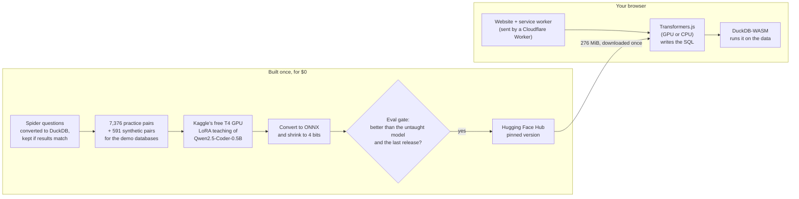
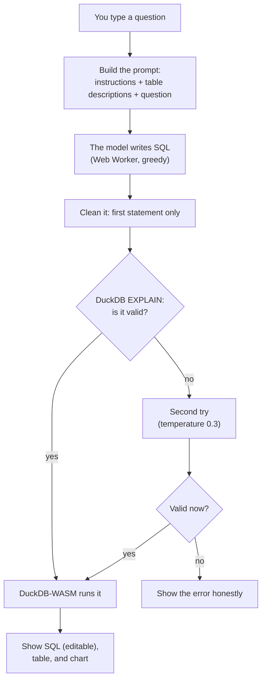

# PocketSQL, explained from zero

This document explains everything in PocketSQL: what it is, every tool it uses,
every decision that was made while building it, and why. You don't need to know
anything about AI or computers. If you read it all, you should be able to
explain the project to anyone, including a recruiter who has never written a
line of code.

The README is the short, technical version. This is the long, plain-language
version. When a word might be new, it's explained the first time it appears,
and there's a [glossary](#glossary) at the end.

**How to read it**

- In a hurry? Read [Part 1](#part-1-the-5-minute-version) (5 minutes) and
  [Part 11](#part-11-explaining-pocketsql-to-a-recruiter).
- Want to really understand it? Read Parts 1 to 6 in order.
- Want every detail and every decision? Read the whole thing.

## Contents

1. [The 5-minute version](#part-1-the-5-minute-version)
2. [The ideas you need](#part-2-the-ideas-you-need)
3. [The rules the project set for itself](#part-3-the-rules-the-project-set-for-itself)
4. [How it was built, step by step](#part-4-how-it-was-built-step-by-step)
5. [How the finished thing works](#part-5-how-the-finished-thing-works)
6. [The scoreboard](#part-6-the-scoreboard)
7. [What didn't work, and what it taught](#part-7-what-didnt-work-and-what-it-taught)
8. [How we know it keeps working](#part-8-how-we-know-it-keeps-working)
9. [Honest limits, and what could come next](#part-9-honest-limits-and-what-could-come-next)
10. [How the work itself was organized](#part-10-how-the-work-itself-was-organized)
11. [Explaining PocketSQL to a recruiter](#part-11-explaining-pocketsql-to-a-recruiter)
12. [Glossary](#glossary)
13. [Where things are in the repository](#where-things-are-in-the-repository)

---

## Part 1: The 5-minute version

### What it does

PocketSQL is a website. You open it, pick a collection of data (a music
store's sales, facts about penguins, or statistics about countries), and type a
question in normal English, like *"Which 5 countries bought the most music?"*

A small AI that lives **inside your web browser** turns your question into
**SQL**, the special language that databases understand. Then a database
program, also running inside your browser, runs that SQL and shows you the
answer as a table, and sometimes as a chart.

The special part: after the first visit, **it works with the internet turned
off.** Nothing you type is sent anywhere. It costs nothing each time you ask.

### A story to picture it

Imagine a huge library where all the books are organized in shelves and
drawers (that's a **database**). The librarian only understands a strict,
coded language (that's **SQL**). You only speak English.

Normally, you'd need a big, expensive translator in a faraway office (a large
AI on the internet, like the ones behind ChatGPT). You'd phone them, wait, and
pay a little for every call.

PocketSQL is a **tiny translator that fits in your pocket**. It's much smaller
than the big one, so it isn't as clever, but it goes everywhere with you, works
without a phone signal, never tells anyone what you asked, and is free.

The project's work was to:

1. **Find a small translator** that was already decent at code (an existing
   open AI model called Qwen2.5-Coder-0.5B).
2. **Teach it** this exact job with thousands of practice questions and
   answers (that's called **fine-tuning**).
3. **Shrink it** so it downloads quickly (that's called **quantization**).
4. **Test it honestly** against the original small model and a giant model.
5. **Build the website** where it runs, offline, in anyone's browser.

### Why it's impressive

- **It's small.** The AI is a 276 MiB download (about 70 songs' worth). Most
  AI models people talk about are hundreds of times bigger.
- **It's private and offline.** Your questions and your data never leave your
  computer.
- **It was free to build and is free to run.** Every step used free services.
  Training took about 2 hours on a free graphics card.
- **It was measured honestly.** The scores come from the exact files your
  browser downloads, and a new version is only released if it beats the old
  one.

### The numbers that matter

| | Tiny model before teaching | **PocketSQL (after teaching)** | Giant model on the internet |
|---|---|---|---|
| Questions answered correctly (on the app's own 100-question exam) | 29 of 100 | **45 of 100** | 77 of 100 |
| Questions answered correctly (on 981 questions about 20 databases it never saw) | 30.9% | **49.3%** | not measured on all 981 |
| Size | 276 MiB | 276 MiB | too big for a browser (117 billion "knobs") |
| Needs the internet? | no | **no** | yes |
| Cost per question | $0 | **$0** | about $0.0001 |

Teaching made the tiny model much better (29 → 45). It's still behind the giant
model, which is about 230 times bigger. That's expected, and the project is
upfront about it.

---

## Part 2: The ideas you need

### 2.1 Data, tables, and databases

A **table** is like a spreadsheet: rows and columns. A penguins table might
have one row per penguin and columns for its species, its island, and its
weight.

A **database** is a collection of tables that belong together. The music store
database has 11 tables: customers, invoices (receipts), tracks (songs), albums,
artists, and so on. Tables are linked: an invoice row says *which* customer
bought something, using the customer's ID number.

### 2.2 SQL: the language databases understand

**SQL** (said "sequel" or "S-Q-L") is a language for asking databases
questions. For example:

```sql
SELECT count(*) FROM Customer;
```

means *"count all the rows in the Customer table"*, in other words, *"how many
customers are there?"*

There are several database programs, and each speaks a slightly different
**dialect** of SQL, like British and American English. PocketSQL uses a
database program called **DuckDB**, so the AI has to write DuckDB's dialect.

**Why DuckDB?** It's built for exactly this kind of question (counting,
summing, averaging, comparing), it's fast, it can run *inside a web page*
(a version called DuckDB-WASM), and it can read spreadsheet-like files (CSV
and Parquet) directly, so you can upload your own data.

### 2.3 What an AI "language model" is

A **language model** is a program that has read a huge amount of text and
learned to guess **what comes next**. Give it the start of a sentence, and it
predicts the next little piece of text, then the next, then the next. Those
little pieces are called **tokens** (a token is a word or part of a word).

Inside, the model is a giant pile of numbers called **parameters**. Think of
them as tiny knobs. Learning means turning the knobs until the guesses get
good. PocketSQL's model has about **500 million** knobs (written "0.5B", B for
billion). That sounds like a lot, but the famous chatbots have hundreds of
billions.

When we give the model a job, we send it a **prompt**: the instructions, the
list of tables and columns, and the question. The model then writes its answer
one token at a time.

Two ways to pick each next token:

- **Greedy:** always pick the single most likely token. Same question, same
  answer, every time. PocketSQL uses this by default.
- **Sampling with a temperature:** pick among the likely tokens with a bit of
  randomness. Temperature 0 means no randomness; higher means more. PocketSQL
  uses temperature 0.3 (a little randomness) only for a second try.

### 2.4 Training and fine-tuning

**Training from scratch** means starting with random knobs and learning
everything, which costs millions of dollars for big models.

**Fine-tuning** means taking a model that already knows a lot (here, one that
already understands English and code) and giving it extra lessons for one
specific job. It's like taking a student who already knows how to read and
write and teaching them one new subject.

PocketSQL uses a cheap kind of fine-tuning called **LoRA**. Instead of turning
all 500 million knobs, LoRA adds a small set of extra knobs (8.8 million, about
1.8% as many) and only turns those. Picture it like sticking notes into a
textbook instead of rewriting the book. At the end, the notes are **merged**
into the book so it becomes one normal model again.

### 2.5 Why "small" and "in the browser" matter

Most AI apps send your question to a big computer somewhere (a **server**) and
wait for the answer. That means:

- you need the internet,
- the company pays for every question (so you usually pay too),
- your data travels to someone else's computer.

Running a small model **inside your browser** fixes all three. The price is
that a small model is less clever. The project's goal was to see how good a
tiny model could get at one specific job, measure it honestly, and make it
genuinely useful.

Computers have two kinds of chips that can run AI:

- The **CPU** (the main processor): good at everything, but does things one
  (or a few) at a time.
- The **GPU** (the graphics card): made for drawing games, which means doing
  thousands of small multiplications at once. AI is mostly multiplications,
  so GPUs are much faster for it.

**WebGPU** is a newer browser feature that lets a web page use the GPU.
PocketSQL uses WebGPU when your browser has it, and falls back to the CPU
(using **WebAssembly**, or **WASM**, a way to run fast code in a browser) when
it doesn't.

### 2.6 How to grade a model fairly

**Execution accuracy (EX).** To check an answer, we don't compare the SQL text
with the "correct" SQL, because the same question can be answered correctly in
many ways (like "2+2" and "4"). Instead, we **run** both queries and compare
the results. Same result = correct. This is the main score everywhere in the
project.

**Valid SQL rate.** The share of answers that run at all, even if they return
the wrong thing.

**Practice, quiz, exam.** Data is split into three groups that never mix:

- **Training set**: the practice problems the model learns from.
- **Validation set** ("val"): a practice quiz, used to check progress during
  training. Its questions come from 16 databases the model never practices on.
- **Test sets**: the final exams. The model never sees them while learning.

If a test question sneaks into the practice problems, the model could just
memorize the answer and look smarter than it is. That's called **leakage**,
and the project has an automatic **leakage check** that fails if it finds any.

---

## Part 3: The rules the project set for itself

Before writing any code, the project wrote down rules that could never be
broken. Each one is there for a reason.

| Rule | What it means | Why |
|---|---|---|
| **$0** | Every service must be free: free GPUs for training (Kaggle), free model hosting (Hugging Face), free website hosting (Cloudflare), free test robots (GitHub Actions). No credit card anywhere. | To prove a useful AI product can be built with no money, and to keep it running forever at no cost. |
| **Public repo, no secrets** | All code is public on GitHub. Passwords and access keys (called **tokens** or **secrets**) never go into it. Large files (models, datasets) go to Hugging Face, not GitHub. | Anyone can inspect the work, and nobody can steal access to the accounts. |
| **License hygiene** | Every model and dataset used must legally allow training and sharing, and its license is written down. | Using data you're not allowed to use is a real legal problem. |
| **Ship what you measured** | Reported scores come from the *exact* files the browser downloads (the shrunken ones), not from the bigger original. | Scores from the original would look better than what users actually get. |
| **Eval gate** | A new model is never released if it scores lower than the previous release or than the untaught base model. | So an update can never make the product worse. |
| **Recruiter-first** | The very first visit must show something working immediately, with visible download progress, and clear messages if the browser lacks WebGPU. | A visitor shouldn't stare at a loading bar for a minute before seeing anything. |

There were also working rules: pin exact versions of every library, model, and
dataset (so results can be reproduced later), change only **one thing per
training run** (so you know what caused an improvement), and keep a log of GPU
hours used.

---

## Part 4: How it was built, step by step

The work was split into 8 **milestones** (M0 to M7), each with a checklist of
"acceptance boxes" that had to pass before moving on. The whole project was
built between **26 and 28 September 2026**.

### M0: Setting up the workshop

**Goal:** have all the tools ready and a placeholder website online.

**What was done**

- A **repository** (a project folder tracked by **git**, a tool that records
  every change) on GitHub.
- A **Python** project in `training/` for everything to do with data and the
  model. Python is the standard language for AI work. It's managed with
  **uv**, a fast tool that installs exact versions of Python libraries.
- A **TypeScript** project for everything that runs in the browser: `web/`
  (the website), `worker/` (the small server), `packages/sqlgen/` (shared
  code), and `evals/` (a test runner). TypeScript is JavaScript (the language
  of web pages) with extra checks that catch mistakes early. It's managed with
  **pnpm**, which installs JavaScript libraries.
- A **Cloudflare Worker** serving a placeholder page at
  `https://pocket-sql.azar-majed7.workers.dev`, with a `/api/health` address
  that answers "ok".
- **CI** (continuous integration): a GitHub Actions robot that runs all the
  checks every time code is pushed.
- The command-line tools for **Kaggle** and **Hugging Face** installed and
  logged in.

**Decisions and why**

- **Biome instead of ESLint + Prettier.** These tools check code style and
  catch common mistakes. Biome does both jobs in one fast tool with one
  settings file, instead of two tools with two settings files.
- **vitest** for quick unit tests of small pieces of code, and **Playwright**
  for "end-to-end" tests, where a robot opens a real browser, clicks around,
  and checks what appears on screen.
- **pytest** and **ruff** for Python: pytest runs tests, ruff checks style.
- A `.gitignore` file lists what must never be committed: model files,
  datasets, secrets, logs. A check proved that model files are ignored while
  training summaries are not.

**Problem found:** the first CI run failed on a type error that the local check
had missed (the local command reported the exit code of the wrong program). It
was fixed, and the lesson written down.

### M1: Collecting the practice questions (data)

**Goal:** thousands of (question, correct DuckDB SQL) pairs to learn from, plus
the three small databases the app shows.

**Where the questions come from: Spider.** Spider is a well-known public
dataset from Yale University (Yu et al., 2018): about 10,000 English questions
over 200 databases, each with the correct SQL. Its license (CC BY-SA 4.0)
allows training and sharing. The download is pinned by its **sha256**, a
fingerprint of the file, so we know we always get exactly the same file.

**The problem:** Spider's SQL is written for a different database program,
**SQLite**, not DuckDB. Different dialect.

**The solution, step by step:**

1. Copy every Spider database from SQLite into DuckDB (all 166 of them). Some
   tables had messy data (numbers stored as text, broken characters), and the
   converter handles those cases.
2. Translate every SQL query from SQLite's dialect to DuckDB's with a tool
   called **sqlglot**.
3. **Run both**: the original query on SQLite and the translated one on
   DuckDB. **Keep the pair only if both return the same result.**

This third step is the key decision: **filter by execution, not by rules.**
Instead of guessing which translations are right, we check each one by actually
running it. At first 88.5% of pairs survived. Looking at why the rest failed
led to four fixes that keep SQLite's meaning in DuckDB (for example, SQLite
treats `"text"` in double quotes as text while DuckDB treats it as a column
name, and SQLite ignores upper/lower case in `LIKE` comparisons while DuckDB
doesn't). After the fixes, **95.9%** survived.

**The split:**

- **7,376 training pairs** (practice).
- **858 validation pairs** from **16 databases** held out completely, so the
  quiz tests databases the model has never seen. Which 16 is decided by a
  fixed fingerprint of each database's name, so it's the same every time.
- **981 Spider "dev" pairs** as a test set: Spider's own official check set,
  on 20 more databases the model never sees.

**The three demo databases** (the ones you can pick in the app):

| Database | What's in it | Why | License |
|---|---|---|---|
| **Chinook** | A pretend online music store: 11 tables of customers, invoices, tracks, albums, artists, employees | Many tables linked together, so it tests joins (combining tables) | MIT |
| **Palmer penguins** | 344 real penguins from 3 islands in Antarctica, with species, bill size, flipper length, weight, sex | One simple, friendly table | CC0 (public domain) |
| **World Bank** | 8 statistics (population, GDP, life expectancy, internet users…) for every country, 2000 to 2023 | Real numbers over time, so it tests dates and trends | CC BY 4.0 |

Each file had to stay under 2 MB so the app loads fast. Chinook was 3 MB at
first, mostly empty space from how DuckDB stores files. Switching to smaller
storage blocks (16 KiB instead of the default) shrank the files to 684, 60, and
524 KiB.

**The prompt format.** This is exactly what the model sees for every question,
and it had to be **identical** in training, in testing, and in the browser.
Otherwise the model would be tested on something it never practiced. It looks
like this:

```text
System: Write one DuckDB SQL query that answers the question. Output only SQL.
User:   CREATE TABLE singer (singer_id BIGINT, name VARCHAR, country VARCHAR /* e.g. 'France', 'Netherlands' */, age BIGINT);
        CREATE TABLE concert (concert_id BIGINT, year BIGINT);

        Question: How many singers are from France?
```

Decisions inside that format:

- **One line per table**, compact, so long database descriptions still fit.
- **Up to 2 example values** for text columns that have 20 or fewer different
  values (like `'France', 'Netherlands'`). This tells the model how the data is
  spelled, so it writes `country = 'France'` and not `country = 'FR'`.
- The model's own **chat template** (the format it was originally built to
  read), so it feels familiar to the model.

**The twin serializer.** The code that writes the prompt exists twice: once in
Python (for training) and once in TypeScript (for the browser). Two copies can
drift apart, so both must reproduce 6 saved example prompts ("golden
fixtures") **byte for byte**, and a test checks that the browser's AI library
cuts them into exactly the same tokens as the Python one. If anything ever
differs, the tests fail.

**Leakage check.** A script compares every practice and quiz question against
every test question and fails if any match exactly, or if two questions on the
same database share 90% or more of their words. It runs in CI on every push.

**An early dataset release.** The dataset was published on Hugging Face as
`MidlightDDK/pocketsql-data` already here, so the CI robot could run the
leakage check against the exact published version.

**One decision left open:** the prompt lists columns and types, but not which
columns link tables together (primary and foreign keys). Adding them might help
the model with joins, but would change the prompt format. It was kept as the
spec described it; it's a candidate for a future improvement.

### M2: Writing the exam and choosing the student

**Goal:** a trustworthy exam on the demo databases, scores for several
candidate models, and proof that a model can actually be converted to run in a
browser.

**The own exam: `own_test`.** Spider's questions are about other databases, so
the project needed its own exam on the three demo databases, the ones visitors
actually use.

- 120 questions with correct SQL were written: some easy, some extra hard.
- 100 were kept as `own_test` (42 on Chinook, 33 on World Bank, 25 on
  penguins; 19 easy, 33 medium, 27 hard, 21 extra hard) and 20 kept in
  reserve.
- Each answer was checked automatically: it must run, must not be empty, and
  must give **the same result when the data is stored in reverse order**. That
  last check catches answers that depend on luck (for example "the top
  customer" when two customers are tied).
- Then every reference answer was reviewed one by one against the data. (At the
  owner's request, this review was done by the AI coding assistant that built
  the project; see [Part 10](#part-10-how-the-work-itself-was-organized).)
  Three questions were reworded to be clearer, like saying "month number"
  instead of leaving the date format open.

**One scorer for everything.** A single Python program grades every model's
answers the same way: run the answer, run the reference, compare results
(ignoring row order unless the question asks for an order, and allowing tiny
rounding differences). One grader means no model gets an easier test.

**The candidates.** Three small open models that the browser AI library can
run:

- **Qwen2.5-Coder-0.5B-Instruct**: 0.5B knobs, trained extra on code.
- **Qwen3-0.6B**: slightly bigger, newer, general-purpose.
- **Qwen3.5-0.8B**: bigger still.

All three are by the Qwen team and use the Apache-2.0 license, which allows
training and sharing.

**The giant for comparison: gpt-oss-120b**, a 117-billion-knob open model,
used through **Groq**, a company that runs models on its fast computers with a
free tier. It gets exactly the same prompt. Its answers are saved (cached) so
they're never paid for twice. It scored 77% on `own_test`, at about $0.00011
per question.

**The export spike: can a model even run in a browser?** This was the biggest
risk in the whole project, so it was tested *before* any teaching. "Spike" is
engineering slang for a quick experiment to test a risky idea.

- Models are normally stored for **PyTorch** (the Python AI toolkit used for
  training). Browsers can't run PyTorch.
- Browsers can run **ONNX** files through **Transformers.js** (a JavaScript
  library that runs AI models in web pages) and **ONNX Runtime** underneath
  it. ONNX is like a PDF for AI models: a universal format many programs can
  open.
- The project checked how the official browser versions of Qwen models were
  made and found they come from the **ONNX Runtime GenAI model builder**. So
  that's the tool used here.
- Two fixes were needed to make the result load in Transformers.js: one size
  setting inside the model's memory (the "KV cache", where the model keeps
  notes about the text so far) had to be written as a fixed number instead of
  a placeholder, and a small settings block (`transformers.js_config`) had to
  be added to tell the library which file to use on GPU and which on CPU.
- **Parity test:** the full-precision ONNX file gave exactly the same answers
  as the PyTorch original on **20 of 20** test prompts. The export is faithful.

**Choosing the student.** The decision was based on the score of the **shrunken
4-bit file the browser would actually load**, then on download size:

| Model | Score before shrinking (own_test / Spider 100) | Score after 4-bit shrinking | Download |
|---|---|---|---|
| **Qwen2.5-Coder-0.5B** | 36% / 39% | **29% / 32%** | **276 MiB** |
| Qwen3-0.6B | 29% / 42% | 20% / 30% (best recipe: 21% / 37%) | 341–552 MiB |
| Qwen3.5-0.8B | 29% / 21% | not exported | 576 MiB |

Qwen3-0.6B looked slightly better on Spider before shrinking, but with only 100
questions a 3-point gap is within luck (about ±5 points). After shrinking, the
coder model was ahead on both exams combined (61 vs 58 correct out of 200) and
was 58% of the size. **Qwen2.5-Coder-0.5B-Instruct won.** The unmodified
browser version was published as `MidlightDDK/pocketsql-base-0.5b`.

**Real-browser test and two surprises.** A small test page (`/spike`) loaded
the model in Chrome:

1. **Downloads were blocked.** Hugging Face answered "not found" whenever the
   request said it came from a `workers.dev` web page (that "came from"
   information is called the **Referer**). Fix: the app downloads model files
   *without* sending a Referer.
2. **The CPU version crashed.** The shrunken model used one special operation
   (for looking up words in a compressed table) that the browser's CPU engine
   doesn't have. Fix: the export rewrites that one operation into standard
   operations. The outputs were checked to be **exactly identical** (zero
   difference) and the file stayed the same size.

### M3: Making extra practice questions (synthetic data)

**Goal:** practice questions about the three demo databases, which Spider
doesn't have.

**Why:** a student who only practices on other databases might not handle
these ones well. (M5 later proved this was a real problem.)

**Where do new questions come from?** They were **generated by other AI
models** ("synthetic" data), with safety checks, because AI can be wrong:

1. **gpt-oss-120b** writes batches of questions about a topic (filters,
   totals, grouping, joins, dates, rankings, and 5 more), each tagged easy to
   extra hard, together with its SQL answer.
2. Two other models, **gpt-oss-20b** and **Qwen3.8-27B**, answer the same
   questions **independently**, seeing only the tables and the question.
3. All three answers are run. **A question is kept only if at least 2 of the 3
   answers return the same result**, and that result isn't empty and doesn't
   change when the data is reversed. The shortest agreeing SQL becomes the
   answer the model will learn.

This is called **self-consistency voting**: if independent experts agree, the
answer is probably right.

**More filters after the vote:**

- Remove duplicates.
- Remove anything too close to an exam question (same words, or **same result
  as an exam answer on the same database**, which catches reworded exam
  questions). 29 were removed this way.
- Remove "top 10" questions with no defined order (the answer would be
  random).

**License check:** all three generator models are Apache-2.0, and Groq's terms
say the outputs belong to the user, so training on them is allowed. The spec
explicitly forbade using outputs from closed commercial AIs, whose terms
usually forbid training competing models.

**Result:** 1,128 questions generated, 701 agreed, **591 kept** (200 Chinook,
200 penguins, 191 World Bank). World Bank stopped at 191 because Groq's free
daily limit ran out, so a "cached-only" mode built the dataset from the calls
already made instead of waiting hours.

**Human-style review:** 50 random kept pairs were checked by reading the
question, the SQL, and the result. **44 of 50 (88%) were accepted**, above the
80% bar. The rejected ones were ambiguous questions, missing values counted in
the wrong group, one off-by-one date range, and one "first ten" with no order
(which led to the automatic filter above). Every verdict is saved in
`training/data/cards/synth_review.json`.

**Published:** the dataset (Spider-derived pairs plus synthetic pairs, plus
the database files needed to score them) is public on Hugging Face as
`MidlightDDK/pocketsql-data`, with a **dataset card** (a documentation page)
listing sources, licenses, filters, and review results.

**Problems solved along the way:** Groq's free tier limits requests per minute
and tokens per day, and one model refused requests allowing more than 1,000
output tokens (undocumented). The generator learned to wait out short limits,
split big requests, and reuse cached answers.

### M4: Teaching the model (training)

**Goal:** fine-tune the chosen model and show it clearly beats the untaught
version.

**Where: Kaggle.** Kaggle (owned by Google) gives free access to GPUs, about
30 hours per week, after verifying your phone number. The training code is a
**Kaggle kernel** (a script Kaggle runs on its machines). It downloads the
exact version of the project's code from GitHub and the exact version of the
dataset from Hugging Face, trains, tests, shrinks, and saves everything.

**The GPU: an NVIDIA T4**, a common data-center card from 2018 with 16 GB of
memory. Kaggle's T4 machine has two cards; the run uses just one so that the
settings below mean exactly what they say.

**The teaching recipe** (and why each setting):

| Setting | Value | In plain words |
|---|---|---|
| Method | LoRA | Sticky notes instead of rewriting the book: fast, cheap, fits on a free GPU. |
| LoRA size ("rank") | 16, applied to all the model's main layers | How big the sticky notes are. 16 is a standard, safe choice. |
| Epochs | 2 | The model reads the whole practice set twice. |
| Batch size | 32 (8 at a time × 4 steps added up) | How many examples it looks at before adjusting its knobs. |
| Learning rate | 0.0002, slowly decreasing ("cosine") | How big each knob adjustment is: start bolder, finish gently. |
| Max length | 1,024 tokens | Longer examples (149 of them) are dropped, not cut off, so no example has a chopped-off answer. |
| Number format | fp16 | The T4 can't use the newer "bf16" number format, so it uses fp16. |
| Seed | 42 | Fixes the random choices so the run can be repeated. |
| **Loss on the SQL only** | | The model is graded only on writing the SQL, not on repeating the question and tables it was given. |

These values came from the project's spec as a sensible starting point.

**Tools: TRL + PEFT** (Hugging Face's standard libraries for this kind of
teaching). The spec suggested a faster tool called **Unsloth**, but its current
version needs older versions of other libraries than the ones the project's
tokenizer and export tests depend on. Plain TRL + PEFT trained the model in 48
minutes, which is fast enough.

**Before spending any GPU time,** the whole pipeline was run on the laptop's
CPU with a tiny slice of data and a single training step, to catch mistakes
cheaply.

**Problems on the way:**

- The first attempts got **no GPU and no internet**, silently, because the
  Kaggle account's phone wasn't verified yet. Now the script **stops
  immediately** if no GPU is attached, instead of training for hours on a CPU.
- Kaggle's pre-installed copy of one library (torchao) was too old and made
  PEFT crash, so the script uninstalls it (it isn't needed).
- Kaggle's log files came down empty on Windows because of a text-encoding
  issue; setting UTF-8 fixed it.
- Saving the taught model rewrote its settings file in a newer format the
  export had never been tested with, so the original settings file is copied
  back.

**Run v1 results** (trained on Spider only, because M3 wasn't finished yet),
on the 858-question quiz from 16 unseen databases:

| | Untaught | After teaching (v1) |
|---|---|---|
| Correct | 43.2% | **59.9%** |
| Valid SQL | 58.6% | 78.4% |
| Extra-hard questions | 13% | 45% |

It took 58 GPU minutes. Every run writes a `summary.json` file (settings, code
version, dataset version, GPU, minutes, scores) that's saved in the repository.

### M5: The final exam, the gate, and the release

**Goal:** test the exact browser files, and release the model only if it
passes the gate.

**Plot twist: v1 failed the gate.** On Spider's exam, v1 was much better than
the untaught model (47.2% vs 30.9%). But on `own_test`, the exam about the
demo databases, it **dropped from 29% to 20%**. It had learned Spider's
habits, which don't fit these databases: putting totals first in the answer,
writing `= 'unknown'` for missing values instead of `IS NULL`, and skipping
table joins. The gate refused to release it.

**Run v2 = v1 + the 591 synthetic demo-database questions. Nothing else
changed.** Because only one thing changed, any difference comes from that one
thing.

**v2 results on the browser files:**

| | Untaught (4-bit) | v1 (4-bit) | **v2 (4-bit)** |
|---|---|---|---|
| own_test (100) | 29% | 20% | **45%** |
| Spider dev (981) | 30.9% | 47.2% | **49.3%** |
| Val (858), before shrinking | 43.0% | 59.9% | 60.0% |

The synthetic data fixed the demo databases without hurting anything else.
**The gate passed.**

**Quantization: shrinking the model.** Each of the model's knobs is a number.
Stored at full detail (16 bits per number) the model is 942 MiB. **4-bit
quantization** stores each number with only 4 bits, a bit like rounding every
price to the nearest dollar, done cleverly in small groups of 32 numbers
("block 32"). The file drops to **276 MiB**. The cost: on `own_test`, 49%
before shrinking becomes 45% after.

Two shrunken versions are shipped:

- **q4f16** for WebGPU: 4-bit knobs, with in-between calculations in 16-bit
  numbers (which GPUs handle fast). 276 MiB download, 45% on `own_test`.
- **q4** for the CPU fallback: 4-bit knobs, 32-bit calculations. 310 MiB, 43%.

**The gate, precisely.** A release candidate's `own_test` score, for each
shipped file, must be at least the untaught model's score *in the same file
format and runtime* (fair comparison), and at least the previous release's.
The thresholds are saved in `evals/baseline.json`.

**Testing where it runs.** The exam for the shipped files is run through
Transformers.js in **Node** (JavaScript outside the browser), the same library
the browser uses, so the scores reflect what users get.

**Parity again.** On 50 quiz questions, the 4-bit files give the same result
as the full-size taught model on 31 of 50, and score 54% vs 60%. That's the
honest price of shrinking.

**An experiment not shipped: "k-quant".** A smarter way of shrinking raised
agreement with the full model from 32/50 to 40/50 for 7 MiB more. But it needs
another fix in the CPU version before it can ship, so it's saved for later.

**Release.** The model is public on Hugging Face as `MidlightDDK/pocketsql-0.5b`
with a **model card** (documentation: intended use, prompt format, training
data and licenses, scores, limitations, GPU hours). Every Hugging Face upload
gets a unique **revision** ID (like a version stamp). The website **pins** the
exact revision `de60f0f`, so it always loads precisely the tested files. The
uploaded files were checked to be byte-identical to the ones scored.

**Weekly re-check:** a GitHub Actions robot (`artifact-eval.yml`) re-downloads
the released model every Monday, re-runs the exam on a CPU, and fails if the
score drops more than 2 points below the recorded baseline.

### M6: The website (the offline app)

**Goal:** the real product: live, fast first impression, works offline.

**Tools used for the website:**

- **React**: a popular library for building interactive web pages out of
  reusable pieces.
- **Vite**: the tool that packages the code into files a browser can load
  quickly.
- **Tailwind**: a way to style the page (colors, spacing, layout).
- **Transformers.js 4.3.0**: runs the AI model.
- **DuckDB-WASM**: runs the SQL.
- **vite-plugin-pwa**: turns the site into a **PWA** (progressive web app),
  meaning it can save itself on your computer and open offline.

**What's on the home page:**

- A **dataset picker** (Chinook, penguins, World Bank) or **upload your own**
  CSV or Parquet file. For an uploaded file, a TypeScript copy of the Python
  schema reader describes its columns for the prompt, and was checked to give
  identical output on the three demo databases.
- The **tables and columns** of the chosen database.
- A **question box**.
- **Six example questions with instant answers.** These are real answers from
  the released model on `own_test` questions it got right, saved ahead of time
  (`python -m pocketsql.evalx.examples`). So a first-time visitor sees real
  results immediately, while the model downloads in the background. They're
  not hand-written, so they don't oversell the model.
- **Download progress**: megabytes, speed, and time left.
- An **"Offline ready"** badge once the app and the model are saved on your
  computer.
- The **SQL is shown and editable**, so you can fix it and run it again.
- A **results table** and an **automatic chart** when the result has a simple
  shape (two columns, one of them numbers): a line for numbers or dates, bars
  for categories.
- A **"Slower mode"** notice when the browser has no WebGPU.

**Other pages:** `/evals` shows every score table, per-difficulty numbers, the
cascade (see M7), and one real mistake of each kind. `/how` shows the pipeline
with links to the training kernel, dataset, and model card.

**Decisions and why:**

- **The model runs in a Web Worker**, a separate background lane in the
  browser. Otherwise the page would freeze while the model thinks. Like a
  restaurant kitchen in the back, so the waiter can keep talking to you.
- **Answer clean-up.** The model's output is cleaned by shared code
  (`packages/sqlgen`): remove any code-block markers, keep only the first
  statement, end it with `;`.
- **Check before running.** The SQL is checked with DuckDB's `EXPLAIN` (which
  plans a query without running it). If it fails, the model gets **one second
  try** with a little randomness (temperature 0.3). If that also fails, the
  error is shown honestly.
- **Greedy by default and at most 256 new tokens**, the same as in the exams,
  so the app behaves like what was measured.
- **One token of warm-up** right after loading, so the GPU prepares its
  programs before your first real question.
- **Model files come from Hugging Face; DuckDB and the ONNX Runtime engine
  come from jsDelivr** (a free public file server for open-source code). They
  aren't bundled into the site because single files over 25 MiB aren't allowed
  on Cloudflare's free hosting, and the engine file is 26 MB.

**How offline works:**

- A **service worker** (a small helper script the browser keeps running for a
  site) saves the app, the three databases, and DuckDB's files the first time
  you visit. Next time, it serves them from your computer, even with no
  network.
- Transformers.js saves the model files in the browser's **Cache Storage**.
- **The offline bug:** the automated offline test found that Transformers.js
  4.3.0 always checks a couple of small tokenizer files on the model's `main`
  (latest) version, even when a specific version is pinned, which needs the
  internet. Fix: the app redirects every model request to the pinned version
  and answers from the cache first. This is safe because a pinned version never
  changes.

**Making the CPU fallback faster.** At first, the CPU version took 50 to 112
seconds per question because it used only one CPU core. Browsers allow several
cores (**threads**) only on pages that promise strict isolation from other
websites, via two security settings called **COOP** and **COEP**. With them on,
the CPU version takes 8 to 26 seconds. The COEP setting chosen,
`credentialless`, is the variant that still lets the Cloudflare "are you
human?" box (below) work.

**The security guest list (CSP).** A **Content Security Policy** tells the
browser which websites the page may talk to: itself, jsDelivr, Hugging Face,
DuckDB's extension server (for Parquet files), and Cloudflare's human check.
Anything else is blocked. The tests check that there are **zero** violations.

**"Compare with a big model."** An optional panel sends the same question to
gpt-oss-120b and shows both answers side by side, with whether they agree. It
runs through the **Cloudflare Worker** (the small server), which:

- asks for a **Turnstile** check first (Cloudflare's free "are you a human?"
  box, a friendlier CAPTCHA), then gives the browser a signed pass (an
  **HMAC-signed cookie**) valid for 30 minutes,
- allows at most **5 comparisons per minute** per visitor,
- uses Groq, or falls back to the same model on Cloudflare's own AI service.

It's built and tested, but **hidden on the live site** until its secrets (the
Turnstile secret and the signing key) are set on the server. The page asks
`/api/health` whether comparison is available and only shows the panel if it
is.

**Tests added:** a "stub" mode (`?generator=stub`) replaces the model with
canned answers so CI can test the whole app in seconds without a 276 MiB
download. A separate robot, `e2e-real.yml`, loads the **real** model in a
headless browser (a browser with no window), goes **offline**, reloads, and
answers 3 questions.

**Speed, measured in real browsers** (time from pressing Ask to seeing the
result, model already downloaded):

| Device | How it runs | Model load | Per question |
|---|---|---|---|
| Laptop (Intel Core i5-10300H, Intel UHD built-in graphics), Chrome | WebGPU, q4f16 | 5.6 s | 1.8–6.7 s |
| Same laptop, CPU only | WASM with threads, q4 | 3.9 s | 8.6–25.7 s |
| GitHub Actions computer (4 CPU cores) | WASM with threads, q4 | 3.0 s | 7.9–26.2 s |

Answers are short (about 30 tokens), so most of the time goes into **reading
the prompt** (the table descriptions). Chinook, with 11 tables, gives the
longest prompt and the slowest answers.

### M7: The cascade, and launch

**Goal:** combine the small model with the giant one, and prepare everything
for the public.

**The cascade: ask the small helper first, the expert only when unsure.**
Every question goes to PocketSQL first, for free. The question goes to
gpt-oss-120b only when PocketSQL's answer looks wrong:

- its SQL fails to run,
- or it returns nothing (no rows, or only empty values),
- or (stricter rule) a second try with a little randomness gives a
  **different** result, a sign the model isn't sure.

| Exam | Rule | Answered locally | Of those, correct | Cascade score | Giant alone | Giant calls per 100 questions |
|---|---|---|---|---|---|---|
| Spider dev (100) | runs and returns rows | 64% | 78% | 74% | 73% | 36 |
| Spider dev (100) | … and a second try agrees | 59% | 85% | **75%** | 73% | **41** |
| own_test | runs and returns rows | 78% | 58% | 59% | 77% | 22 |
| own_test | … and a second try agrees | 69% | 62% | 62% | 77% | 31 |

On Spider, the cascade **beats the giant alone** (75% vs 73%) while calling it
only 41 times per 100 questions instead of 100 (59% fewer calls). On the demo
databases it doesn't pay off: most of PocketSQL's mistakes there are SQL that
runs fine but answers the wrong thing, which these checks can't detect. Both
results are reported.

**Browser Analyst.** The same model became "tier 0" (the first, cheapest step)
in a sibling project, Browser Analyst, a data-analyst AI agent. The shared
prompt code was copied into it. On its 100-task benchmark, PocketSQL answered
36 tasks locally (25 right), and the combined system scored 86% vs 94% for the
agent alone, with 30% fewer calls to the big AI. Since it lost 8 points, it was
**not** switched on in Browser Analyst's live app, and that project's README
says why.

**Launch work:**

- The **README** was rewritten for recruiters: pitch, live link, results,
  diagram, design decisions, failures, methodology, reproduction steps,
  licenses, and limitations.
- **`smoke.yml`**: a robot that checks the live website every day (loads the
  page, shows an example, runs DuckDB, checks `/api/health`, loads the model)
  and **opens a GitHub issue** if anything fails.
- **A 1-minute demo video**, recorded by a script driving Chrome on the live
  site, with captions, and with the waiting parts sped up and labeled as sped
  up. It's in the README and on YouTube (unlisted).
- The shared prompt code (`packages/sqlgen`) could be published as an npm
  package (a public JavaScript library); it was copied into Browser Analyst
  instead, because publishing needs an account decision by the owner.

**Status on 28 September 2026:** everything is built, deployed, and pushed. The
last box waits for the daily smoke test to be green for 3 days in a row.

---

## Part 5: How the finished thing works

### 5.1 Two halves: built once, and runs in your browser



**The left half** happened once, on free services: collect and check data,
teach the model on Kaggle, shrink it, test it, and release it on Hugging Face.

**The right half** happens on your computer every time you ask something. The
Cloudflare Worker only hands out the website's files; it never sees your
questions (unless you press "Compare with a big model", which is off on the
live site).

### 5.2 What happens when you press "Ask"



1. The app builds the prompt with the same code used in training.
2. The model, running in a background Web Worker, writes the SQL token by
   token (you see it appear).
3. The answer is cleaned up.
4. DuckDB checks it with `EXPLAIN`.
5. If it's broken, the model gets one second try with a little randomness.
6. DuckDB-WASM runs the SQL on the database in your browser (with a 10-second
   limit and at most 500 rows shown).
7. You see the SQL, the table, and a chart if the shape fits.

### 5.3 The first visit vs later visits

**First visit:** the page loads, examples show instantly, the app checks for
WebGPU, and the model starts downloading (276 MiB, or 310 MiB without WebGPU)
with a progress bar. Once it's done, and the service worker has saved the app,
the "Offline ready" badge appears.

**Later visits, even offline:** the service worker serves the app and
databases from your computer; Transformers.js loads the model from its cache in
a few seconds.

### 5.4 Where everything lives

| Service | What it holds or does | Cost |
|---|---|---|
| **GitHub** | All the code, test sets, scores, and the robots (GitHub Actions) that run checks | free (public repo) |
| **Hugging Face Hub** | The released model (`MidlightDDK/pocketsql-0.5b`), the untaught browser version (`pocketsql-base-0.5b`), and the dataset (`pocketsql-data`) | free (public repos) |
| **Kaggle** | The training script and the free T4 GPU it ran on | free (about 30 GPU hours a week) |
| **Cloudflare Workers** | Serves the website and the small `/api` server | free plan |
| **jsDelivr** | Public copies of DuckDB-WASM and ONNX Runtime files | free |
| **Groq** | The giant model for the comparison scores and synthetic data | free tier |
| **Your browser** | Runs the model and the database | your own computer |

### 5.5 Safety and secrets

- Secret keys are never written in the code. They live where each tool keeps
  them on the owner's computer, or in Cloudflare's and GitHub's secret
  storage.
- The project's AI-assistant settings (`.claude/settings.json`) forbid reading
  secret files and require approval before pushing code, deploying, training
  on Kaggle, or uploading to Hugging Face.
- Everything in the `web/` folder is sent to browsers, so it's treated as
  public: only public values (like the Turnstile "site key", which is meant to
  be public) go there.

---

## Part 6: The scoreboard

### 6.1 Accuracy

"EX" = the share of questions where the SQL returned the right result.

| Model | Runs as | own_test | Valid SQL | Spider dev (981) | Download | Cost per question |
|---|---|---|---|---|---|---|
| **PocketSQL (shipped)** | 4-bit, WebGPU | **45%** | 83% | **49.3%** | 276 MiB | **$0** |
| PocketSQL | 4-bit, CPU fallback | 43% | 83% | | 310 MiB | $0 |
| PocketSQL | full size, before shrinking | 49% | 90% | | | |
| Qwen2.5-Coder-0.5B (untaught) | same 4-bit export | 29% | 54% | 30.9% | 276 MiB | $0 |
| gpt-oss-120b (giant, for reference) | Groq API | 77% | 95% | | none | $0.00011 |

**By difficulty on `own_test`** (PocketSQL / untaught / giant):

| Easy | Medium | Hard | Extra hard |
|---|---|---|---|
| 84% / 74% / 95% | 55% / 33% / 88% | 26% / 15% / 63% | 19% / 0% / 62% |

So PocketSQL is good at simple lookups and totals, and weak at multi-step
questions.

### 6.2 What kind of mistakes it makes

Every wrong answer is tagged automatically, from DuckDB's error message or the
shape of the query:

| Mistake | PocketSQL | Untaught | Giant |
|---|---|---|---|
| **Invented a table or column** that doesn't exist | 12 | 40 | 4 |
| Used the wrong (but real) column or table | 11 | 9 | 9 |
| Wrong totals, counts, or averages | 9 | 11 | 4 |
| Wrong way of combining tables | 3 | 1 | 1 |
| Not valid DuckDB syntax | 2 | 1 | 0 |
| Valid SQL, wrong result for another reason | 18 | 9 | 5 |
| **Total wrong (out of 100)** | **55** | **71** | **23** |

The biggest win from teaching: **far fewer invented tables and columns** (40 →
12). The model learned to stick to what's actually in the database.

A real example of a mistake: asked *"Give the names of tracks longer than 20
minutes"*, the model wrote `Milliseconds > 20000`, which is 20 **seconds**, not
20 minutes (the right number is 1,200,000). The SQL runs fine; it just answers
a different question. That's the hardest kind of mistake to catch.

### 6.3 How much it cost

- **Training:** about 2 GPU hours on Kaggle's free T4 (v1: 58 minutes, v2: 61
  minutes, plus a few minutes of failed starts). Kaggle gives about 30 free
  hours a week.
- **Hosting:** $0 (Cloudflare free plan, Hugging Face public repos, GitHub).
- **Per question:** $0, because it runs on your own computer. The giant model
  would cost about $0.00011 per question, which is small, but it adds up at
  scale and needs the internet.

### 6.4 How confident are these numbers?

Each score comes from one run per model on 100 to 981 questions, without
repeating runs to measure variation. With 100 questions, differences of about
5 points could be luck. The README says so.

---

## Part 7: What didn't work, and what it taught

Failures are part of the project's story, and the README lists them openly.

| What was tried | What happened | Lesson |
|---|---|---|
| **Teaching on Spider only (v1)** | Better on Spider, **worse** on the demo databases (29% → 20%). The gate blocked it. | Practice on the kind of data you'll be tested on. The fix (v2) was adding 591 demo-database questions, and only that. |
| **Unsloth** (a faster training tool) | Needed older library versions than the rest of the project. | Plain TRL + PEFT was fast enough (48 minutes). |
| **Qwen3-0.6B** | Better before shrinking, worse after, and bigger. Even the official browser version was twice the size and no more accurate. | Judge a model in the form users will actually get. |
| **k-quant** (smarter shrinking) | Real but modest gain; needs another fix for the CPU version. | Saved for a future release. |
| **The CPU engine in browsers** | Missing one special operation the shrunken model used. | Rewrote that operation with standard building blocks; identical results. |
| **Downloading from a `workers.dev` page** | Hugging Face refused requests carrying that Referer. | Download model files with no Referer. |
| **Offline reloads** | Transformers.js 4.3.0 checked the `main` version online even with a pinned version. | Redirect everything to the pinned version, cache first. Only a real offline test could have found this. |
| **The cascade on the demo databases** | Loses 15 points against the giant alone. | Checks for "broken" or "empty" can't catch answers that are valid but wrong. |

---

## Part 8: How we know it keeps working

A lot of the project is checking, not building. Here are the checks and robots:

| Check | When | What it does |
|---|---|---|
| **Python tests** (pytest, 65 tests) | every push | Data conversion, the scorer, the gate, the synthetic filters, the serializer, and more. |
| **JavaScript tests** (vitest, 27 tests) | every push | The TypeScript serializer, SQL clean-up, schema reader, the Worker's API. |
| **Golden fixtures and token parity** | every push | Python and TypeScript produce byte-identical prompts and identical tokens. |
| **Leakage check** | every push | No practice or quiz question matches an exam question. |
| **Style and type checks** (ruff, Biome, TypeScript) | every push | Catch mistakes and keep code consistent. |
| **App tests with a stub model** (Playwright, `ci.yml`) | every push | The whole app works (including an offline reload) with zero security-policy violations. |
| **Real-model offline test** (`e2e-real.yml`) | pushes to main | Downloads the real model, goes offline, reloads, answers 3 questions. |
| **Weekly artifact eval** (`artifact-eval.yml`) | every Monday | Re-scores the released model and fails if it drops. |
| **Daily smoke test** (`smoke.yml`) | every day | Checks the live website; opens an issue if it breaks. |
| **The release gate** | before any release | Refuses a model that's worse than the untaught one or the last release. |

The website itself is deployed by hand with one command
(`pnpm run deploy`, which uses Cloudflare's **wrangler** tool).

---

## Part 9: Honest limits, and what could come next

**Limits** (also in the README):

- It gets **45%** of the demo-database exam right: useful for simple lookups
  and totals, unreliable for multi-step questions (26% hard, 19% extra hard).
  Always check the SQL before trusting a result. That's why the SQL is always
  shown and editable.
- It only writes DuckDB SQL, and works best when the prompt is under 1,024
  tokens. Very wide databases and unfamiliar topics are harder.
- The first visit downloads 276 MiB (310 MiB without WebGPU). Without WebGPU,
  each question takes 8 to 26 seconds.
- "Compare with a big model" is hidden until its server secrets are set.
- Scores come from one run each, with no error bars.

**Ideas for next steps** (each would be one change, tested through the gate):

- Ship the k-quant shrinking once the CPU version supports it.
- Add primary and foreign keys to the prompt, to help with joins.
- Try 1 epoch instead of 2: the quiz loss (a measure of error on the quiz)
  went up slightly during the second epoch, a hint of over-practicing
  (**overfitting**).
- Publish `packages/sqlgen` on npm.
- Turn on "Compare with a big model" by setting its secrets.
- Make the Kaggle training notebook public (its link currently shows "not
  found" to visitors because it's private).

---

## Part 10: How the work itself was organized

### The written plan

Before any code, the project had a written spec:

- **`CLAUDE.md`**: the mission, the hard rules, the commands, and the
  milestone checklist.
- **`.claude/rules/`**: detailed rules for each area (data, training, evals,
  web).
- **`docs/ROADMAP.md`**: the 8 milestones with their acceptance boxes, and the
  outline for the README.

### Who did what

The project was built with **Claude Code**, an AI coding assistant, working
from that spec over about ten working sessions, one or two milestones each. At the
start of each session, the assistant read a handoff note (`HANDOFF.md`, kept
out of git) that described the current state, and rewrote it at the end.

The owner set some standing instructions that shaped how the work was done:

- **Work autonomously** through each milestone: post a short plan, then
  execute without waiting for approval.
- **Work directly on the `main` branch** (no side branches or pull requests),
  and deploy and push when a milestone is done.
- **No human reviews:** the assistant performed every "user verifies" step
  itself and recorded how: checking all 120 exam answers, reviewing the 50
  synthetic pairs, loading the model in a real browser, measuring speeds, and
  checking the README.
- Reuse accounts and keys from the owner's other projects, without ever
  printing secret values.

Some steps physically needed the owner: creating free accounts (Kaggle with
phone verification, Hugging Face, Cloudflare, Groq), logging the command-line
tools in, and approving uploads of the demo video to GitHub and YouTube.

### Timeline

| Milestone | When (2026) |
|---|---|
| M0 Workshop set up, placeholder site live | 26 Sep, morning |
| M1 Spider converted, demo databases, prompt format | 26 Sep, morning |
| M2 Own exam, baselines, model choice, browser export | 26 Sep, midday |
| M3 Synthetic data and dataset release | 26 Sep, afternoon to night (waiting on free-tier limits) |
| M4 First training run (v1) on Kaggle | 26 Sep, evening |
| M5 v1 blocked by the gate, v2 trained, tested, released | 26–27 Sep, night |
| M6 The offline web app | 28 Sep, morning |
| M7 Cascade, README, smoke test, demo video | 28 Sep, morning |

---

## Part 11: Explaining PocketSQL to a recruiter

### The 30-second version

> "PocketSQL lets you ask questions about data in plain English. A small AI
> model turns the question into SQL, the language databases use, and a database
> runs it. Everything happens inside your web browser: no server, no cost per
> question, and it keeps working with Wi-Fi off. I took an existing 0.5-billion
> parameter open model, fine-tuned it on about 8,000 examples on a free GPU,
> shrank it to a 276 MB download, and measured it honestly: it went from 29%
> to 45% correct on my own test set, while a 117-billion-parameter model gets
> 77%. It's live, and the whole thing cost $0."

### The 2-minute version (five steps)

1. **Data:** "I took a public dataset of about 10,000 English-to-SQL questions,
   converted it to the DuckDB database, and kept only the examples where the
   converted answer returned exactly the same result. I also generated 591
   extra examples for my demo databases with three AI models, and kept a
   question only when two of the three agreed."
2. **Training:** "I fine-tuned Qwen2.5-Coder-0.5B with LoRA on Kaggle's free
   T4 GPU. It took about an hour per run."
3. **Shrinking:** "I converted it to ONNX and quantized it to 4 bits, from
   942 MiB to 276 MiB, and measured what that cost: 4 points of accuracy."
4. **Testing and release:** "Every model is graded by running its SQL and
   comparing results. There's a release gate: my first model got better on the
   public benchmark but worse on my demo databases, so the gate blocked it. I
   fixed it by adding data for those databases, changing only that one thing."
5. **Product:** "The website runs the model on the GPU through WebGPU, or the
   CPU as a fallback, checks the SQL before running it, retries once if it's
   broken, and works offline after the first visit. Automated tests check the
   offline mode with the real model, and a robot checks the live site every
   day."

### Questions a recruiter might ask

**"Why not just use ChatGPT?"**
Privacy (data never leaves the computer), cost ($0 per question), and it works
offline. The project also shows a combined approach: use the small model first
and the big one only when unsure. On one benchmark, that beat the big model
alone while calling it 59% less often.

**"Is 45% good?"**
For a model this small, running in a browser, it's a big jump from 29%. It's
honest about being behind the big model (77%). It's reliable for simple
questions (84% on easy ones) and shows the SQL so users can check it.

**"What was the hardest part?"**
Making a trained model actually run in browsers: the conversion, the missing
CPU operation, the blocked downloads, and the offline bug. That's why the
conversion was tested first, before any training.

**"How do you know the numbers are real?"**
They come from the exact files the browser downloads, graded by running the
SQL, on test questions that are automatically checked to never appear in the
training data. All predictions and scores are saved in the repository.

**"What did it cost?"**
Nothing. Free GPUs on Kaggle (about 2 hours), free hosting on Hugging Face and
Cloudflare, free test robots on GitHub.

**"What would you do next?"**
Better shrinking (k-quant), adding table relationships to the prompt, and
trying fewer training passes, each as a single change tested through the gate.

---

## Glossary

- **API**: a way for one program to ask another program for something over the
  internet. "Calling the API" = sending it a request.
- **Apache-2.0, MIT, CC BY, CC BY-SA, CC0**: licenses, the legal terms that
  say what you can do with code or data. All the ones used here allow training
  and sharing (some require giving credit, CC BY-SA also requires sharing
  derived data under the same terms).
- **Batch**: a group of examples the model looks at before adjusting its knobs.
- **Browser**: the program you use to visit websites (Chrome, Edge, Firefox,
  Safari).
- **Cache**: a saved copy of something so it doesn't have to be downloaded
  again.
- **Cascade**: try the cheap option first, and pass the question to the
  expensive option only when the cheap one seems unsure.
- **CI (continuous integration)**: robots that automatically test the code
  every time it changes.
- **Cloudflare Worker**: a small program that runs on Cloudflare's computers
  around the world; here it serves the website and the `/api` addresses.
- **COOP / COEP**: browser security settings that isolate a page from other
  sites; required for using several CPU threads.
- **CPU**: the computer's main processor.
- **CSP (Content Security Policy)**: a guest list of websites a page may talk
  to.
- **CSV / Parquet**: file formats for tables. CSV is plain text; Parquet is
  compact and fast.
- **Database**: a collection of tables that belong together.
- **Dataset**: a collection of examples, here (question, SQL) pairs.
- **Deploy**: put a new version of the website online.
- **Dialect**: one database's version of SQL.
- **DuckDB / DuckDB-WASM**: a database program designed for analysis; the WASM
  version runs inside a web page.
- **Epoch**: one full pass through the practice set.
- **Eval / evaluation**: testing a model and scoring it.
- **Eval gate**: the rule that blocks releasing a worse model.
- **EX (execution accuracy)**: the share of questions where the SQL's result
  matches the correct result.
- **EXPLAIN**: a DuckDB command that checks and plans a query without running
  it.
- **Fine-tuning**: extra lessons for a model that already knows a lot.
- **fp16 / fp32 / bf16**: ways to store numbers with 16 or 32 bits. More bits =
  more precise but bigger.
- **git / GitHub**: git records every change to the code; GitHub stores it
  online.
- **GitHub Actions**: GitHub's free robots that run tasks (tests, checks) on
  their computers.
- **GPU**: a graphics card; very fast at the math AI needs.
- **Greedy decoding**: always choosing the most likely next token.
- **Groq**: a company that runs AI models on fast computers, with a free tier.
- **Hallucination (here, "invented schema")**: the model making up a table or
  column that doesn't exist.
- **HMAC-signed cookie**: a small pass stored in your browser, stamped with a
  secret so it can't be forged.
- **Hugging Face Hub**: a website that hosts AI models and datasets, a bit like
  GitHub for AI.
- **Kaggle**: a data-science website (owned by Google) that offers free GPU
  time.
- **Kernel (Kaggle)**: a script Kaggle runs on its computers.
- **KV cache**: the model's scratch notes about the text it has read so far,
  which speed up writing each next token.
- **Language model**: an AI that predicts the next piece of text.
- **Leakage**: test questions accidentally showing up in the practice data.
- **Learning rate**: how big each knob adjustment is during training.
- **LoRA**: a cheap way to fine-tune by adding a small set of extra knobs
  ("sticky notes") instead of changing all of them.
- **Loss**: a number measuring how wrong the model's guesses are; training
  tries to make it smaller.
- **MiB / KiB**: units of size. 1 MiB is about 1.05 million bytes; 276 MiB is
  about 290 MB.
- **Model card / dataset card**: the documentation page for a model or dataset.
- **Node**: a way to run JavaScript outside a browser.
- **npm / pnpm**: tools for sharing and installing JavaScript libraries.
- **Offline**: without an internet connection.
- **ONNX**: a universal file format for AI models (like PDF for documents).
- **ONNX Runtime**: the engine that runs ONNX models.
- **Overfitting**: practicing so much on the same examples that the model does
  slightly worse on new ones.
- **Parameters**: the numbers ("knobs") inside a model that are learned.
- **Parity test**: checking that two versions of something produce the same
  output.
- **Pinning**: always using one exact version of a file, library, or model.
- **Playwright**: a tool that drives a real browser to test a website
  automatically.
- **Prompt**: the text given to the model: instructions, context, and the
  question.
- **PWA (progressive web app)**: a website that can save itself and work
  offline, like an app.
- **Python / TypeScript / JavaScript**: programming languages. Python is used
  for AI and data here; TypeScript (JavaScript with extra checks) for the
  website.
- **PyTorch**: the Python toolkit used to train AI models.
- **Quantization**: storing a model's numbers with fewer bits so it's smaller
  (here, 4 bits), at a small cost in accuracy.
- **q4 / q4f16**: the two 4-bit versions shipped: q4f16 for GPUs (WebGPU),
  q4 for the CPU fallback.
- **Rate limit**: a cap on how many requests are allowed per minute or day.
- **React / Vite / Tailwind**: tools for building, packaging, and styling the
  website.
- **Referer**: information a browser sends saying which page a request came
  from.
- **Repository (repo)**: a project folder tracked by git.
- **Revision**: one exact saved version of a model or dataset on Hugging Face.
- **Schema**: the list of tables and columns in a database (and their types).
- **Secret / token (access)**: a password-like key for an account. Never
  shared.
- **Serializer**: the code that turns the database's structure into the text
  of the prompt.
- **Service worker**: a small helper script a website installs in your
  browser, used here to work offline.
- **sha256**: a fingerprint of a file; if one byte changes, the fingerprint
  changes.
- **Smoke test**: a quick check that the basics work ("is there smoke coming
  out of it?").
- **Spider**: a public dataset of about 10,000 English questions with SQL
  answers, from Yale.
- **SQL**: the language for asking databases questions.
- **SQLite**: another database program; Spider was written for it.
- **sqlglot**: a tool that translates SQL between dialects.
- **Stub**: a fake stand-in used in tests (here, a fake model with canned
  answers).
- **Synthetic data**: examples generated by AI models rather than written by
  people.
- **Temperature**: how much randomness the model uses when choosing tokens.
- **Test set / validation set / training set**: the final exam, the practice
  quiz, and the practice problems.
- **Threads**: separate lanes of work a CPU can run at the same time.
- **Token (text)**: a word or piece of a word the model reads and writes.
- **Transformers.js**: a JavaScript library that runs AI models in browsers and
  Node.
- **Turnstile**: Cloudflare's free "are you a human?" check.
- **uv**: a fast tool for installing Python and exact library versions.
- **WASM (WebAssembly)**: a way to run fast code in a browser, on the CPU.
- **Web Worker**: a background lane in the browser, so heavy work doesn't
  freeze the page.
- **WebGPU**: a browser feature that lets web pages use the GPU.

---

## Where things are in the repository

| Folder or file | What's in it |
|---|---|
| `README.md` | The short, technical summary with all the numbers. |
| `training/` | The Python package `pocketsql`: `data/` (Spider conversion, demo databases, leakage check, prompt serializer), `synth/` (synthetic data), `train/` (teaching), `export/` (ONNX conversion and shrinking), `evalx/` (scorer, baselines, cascade, examples), `release/` (the gate). `configs/` holds the v1 and v2 recipes; `runs/v1` and `runs/v2` hold each run's `summary.json`. |
| `kaggle/train/` | The script Kaggle runs to train. |
| `packages/sqlgen/` | Shared TypeScript code: prompt builder, SQL clean-up, schema reader, and the golden fixtures. |
| `evals/` | The exams (`sets/`), every model's saved answers (`predictions/`), the score reports (`reports/latest.json`), the release baseline, and the Node exam runner. |
| `web/` | The website: `src/` (pages, model worker, DuckDB code), `public/data/` (the three demo databases), `public/_headers` (security settings), `e2e/` (browser tests). |
| `worker/` | The Cloudflare Worker: serves the site and the `/api` (health, session, compare). |
| `.github/workflows/` | The robots: `ci.yml`, `e2e-real.yml`, `artifact-eval.yml`, `smoke.yml`. |
| `CLAUDE.md`, `.claude/rules/`, `docs/ROADMAP.md` | The written spec the project was built from. |
