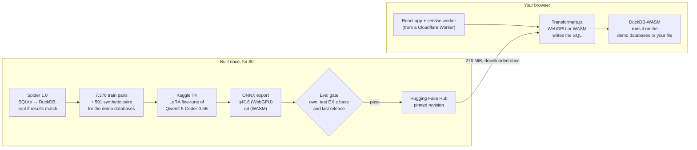

# PocketSQL

**A 0.5B model I fine-tuned to turn plain-English questions into DuckDB SQL,
running entirely in your browser. It keeps working with Wi-Fi off.**

[](https://github.com/MidlightDDK/pocketsql/actions/workflows/ci.yml)
[](https://github.com/MidlightDDK/pocketsql/actions/workflows/smoke.yml)
[](https://github.com/MidlightDDK/pocketsql/actions/workflows/e2e-real.yml)

**Live:** https://pocket-sql.azar-majed7.workers.dev ·
[Evals](https://pocket-sql.azar-majed7.workers.dev/evals) ·
[How it works](https://pocket-sql.azar-majed7.workers.dev/how) ·
Model [MidlightDDK/pocketsql-0.5b](https://huggingface.co/MidlightDDK/pocketsql-0.5b) ·
Dataset [MidlightDDK/pocketsql-data](https://huggingface.co/datasets/MidlightDDK/pocketsql-data)

https://github.com/user-attachments/assets/34a5ced4-593d-4766-8890-69dc684cd24c

**Demo (1 minute, captioned):** play it above or
[watch it on YouTube](https://youtu.be/Xn-_7zZTkJo). A first visit shows real
answers instantly while the model downloads, then a question answered on
WebGPU, then the network cut, a reload, and another answer, then the evals.
The download and the first answer's warm-up are sped up and labeled.

> **Turn off your Wi-Fi and try it.** Open the demo once and wait for the
> "Offline ready" badge (the model is a one-time 276 MiB download). Then
> disconnect and reload: the model, the app, and the three demo databases are
> cached in your browser, so questions still get answered.

Pick a database (a music store, Palmer penguins, or World Bank indicators), or
upload a CSV or Parquet file, and ask a question. The model writes one DuckDB
query on your GPU through WebGPU (or on the CPU with WebAssembly), DuckDB-WASM
runs it, and you get the SQL (editable), a table, and a chart for simple
shapes. Six example questions show real answers from this model instantly, so
the first visit is useful while the model downloads with visible progress.
Nothing leaves the tab and nothing costs anything per query.

## Results

Execution accuracy (EX): the generated SQL runs on DuckDB and must return the
same result as the reference query. Rows marked ONNX are 4-bit files run
through Transformers.js 4.3.0, the browser's runtime; PocketSQL's are the exact
files the app downloads. PyTorch rows are context only. Reports:
[evals/reports/latest.json](evals/reports/latest.json), also rendered on the
[/evals](https://pocket-sql.azar-majed7.workers.dev/evals) page.

| Model | Runs as | own_test EX | Valid SQL | Spider-dev EX (981) | Spider-dev EX (100) | Download | Cost per query |
|---|---|---|---|---|---|---|---|
| **PocketSQL 0.5B (shipped)** | **ONNX q4f16, WebGPU** | **45%** | 83% | **49.3%** | 53% | 276 MiB | **$0** |
| PocketSQL 0.5B | ONNX q4, WASM fallback | 43% | 83% | | 54% | 310 MiB | $0 |
| PocketSQL 0.5B | PyTorch, before quantization | 49% | 90% | | | | |
| Qwen2.5-Coder-0.5B-Instruct (base) | same ONNX q4f16 export | 29% | 54% | 30.9% | 32% | 276 MiB | $0 |
| Qwen2.5-Coder-0.5B-Instruct (base) | PyTorch | 36% | 58% | | 39% | | |
| gpt-oss-120b (117B, reference) | Groq API | 77% | 95% | | 73% | none | $0.00011 |

`own_test` is 100 questions over the three demo databases, each reference query
checked by hand; Spider dev is 20 databases the model never saw. Fine-tuning
took the 4-bit model from 29% to 45% on the demo databases and from
30.9% to 49.3% on Spider dev. A 120B API model is still ahead, mostly on hard
and extra-hard questions (see [Methodology](#eval-methodology-and-error-taxonomy)).

**Speed in real browsers** (time from Ask to result, model files cached; one
question per demo database, the first on Chinook's 11 tables, which gives the
longest prompt):

| Device | Browser | Backend | Model load | Per question |
|---|---|---|---|---|
| Laptop: Core i5-10300H, Intel UHD integrated GPU | Chrome 153 | WebGPU, q4f16 | 5.6 s | 1.8–6.7 s |
| Same laptop, CPU only | Chromium 153 headless | WASM (threaded), q4 | 3.9 s | 8.6–25.7 s |
| GitHub Actions runner, 4 vCPU | Chromium 153 headless | WASM (threaded), q4 | 3.0 s | 7.9–26.2 s |

Answers are short (about 30 tokens), so the time goes mostly into reading the
prompt (the schema); in Node on the same laptop the median own_test question
takes 0.6 s on WebGPU and 3.4 s on the CPU.

**Cascade: local first, API when unsure.** PocketSQL answers every question
first, for free; the question goes to gpt-oss-120b only when the local answer
looks wrong: its SQL fails to run or returns nothing, or (second rule) a second
sample at temperature 0.3 returns a different result
([`pocketsql.evalx.cascade`](training/src/pocketsql/evalx/cascade.py)).

| Set | Keep the local answer if | Answered locally | Local answers right | Cascade EX | API alone | API calls per 100 |
|---|---|---|---|---|---|---|
| Spider dev (100) | SQL runs and returns rows | 64% | 78% | 74% | 73% | 36 |
| Spider dev (100) | … and a second sample agrees | 59% | 85% | **75%** | 73% | **41** |
| own_test | SQL runs and returns rows | 78% | 58% | 59% | 77% | 22 |
| own_test | … and a second sample agrees | 69% | 62% | 62% | 77% | 31 |

On Spider dev the cascade beats the 120B model alone while making 59% fewer
API calls. On the demo databases it doesn't pay: most of PocketSQL's wrong
answers there are valid SQL that returns the wrong rows, which these checks
can't see. The same model is tier 0 in
[Browser Analyst](https://github.com/MidlightDDK/browser-analyst#tier-0-a-small-local-model-first),
my data-analyst agent: it answers 36 of that benchmark's 100 tasks locally
(25 right), and the cascade scores 86% vs 94% for the agent alone with 30%
fewer LLM calls. Of the 8 tasks it loses, 3 are questions the agent asked
about or declined, which a model that only writes SQL can't do.

## How it works



1. **Data.** Spider's SQLite databases and gold queries are converted to
   DuckDB, and a pair is kept only if DuckDB returns the same result as SQLite.
   On top of that, 591 synthetic pairs over the three demo databases, kept only
   when independent models' queries agree.
2. **Training** on Kaggle's free T4: LoRA on Qwen2.5-Coder-0.5B-Instruct, loss on
   the SQL only, then merge and export to 4-bit ONNX in the same kernel.
3. **Evaluation and release.** The exported files are scored in Node with
   Transformers.js, the same runtime as the browser, and published to the Hub
   only if they beat both the base model and the previous release.
4. **The app** loads the pinned model revision in a Web Worker, cleans the
   output (first statement only), checks it with DuckDB's `EXPLAIN`, retries
   once with a sampled answer if it fails, and runs it in DuckDB-WASM. A PWA
   service worker caches the app and databases; the model stays in the
   browser's Cache Storage, which is what makes it work offline.

> **The $0 pipeline.** Training: Kaggle's free GPUs, about 2 GPU hours in total
> (two runs of about an hour on a T4). Model and dataset hosting: the Hugging
> Face Hub (public repos). Web hosting: Cloudflare Workers Free. CI, the weekly
> artifact eval, the offline end-to-end test, and the daily smoke test: GitHub
> Actions. Synthetic data: Groq's free tier. Inference: your browser, at $0 per
> query.

## Design decisions

- **Base model: Qwen2.5-Coder-0.5B-Instruct** (Apache-2.0), chosen over
  Qwen3-0.6B and Qwen3.5-0.8B on the zero-shot EX of the artifact the browser
  would load, then download size. Scored on `own_test` and the first 100
  Spider-dev items, greedy decoding, same prompt everywhere:

  | Model | Runtime | own_test EX | Spider-dev EX (100) | Browser download |
  |---|---|---|---|---|
  | **Qwen2.5-Coder-0.5B-Instruct** | PyTorch fp32 | 36% | 39% | |
  | | **ONNX q4f16 (my export)** | **29%** | **32%** | **276 MiB** |
  | Qwen3-0.6B | PyTorch fp32 | 29% | 42% | |
  | | ONNX q4f16 (my export) | 20% | 30% | 341 MiB |
  | | ONNX q4f16, k-quant + int8 layers | 21% | 37% | 477 MiB |
  | | ONNX q4f16 (onnx-community) | 19% | 32% | 552 MiB |
  | Qwen3.5-0.8B | PyTorch fp32 | 29% | 21% | 576 MiB (onnx-community) |

  Qwen3-0.6B's 3-point Spider-dev lead in PyTorch is within noise at n = 100
  (±5 points); after 4-bit quantization the coder model is ahead on both sets
  combined (61 vs 58 of 200 for Qwen3's best recipe) at 58% of the download.
- **Export path:** the ONNX Runtime GenAI model builder (the tool behind the
  onnx-community Qwen builds), then two fixes for Transformers.js (KV-cache head
  dimension pinned, `transformers.js_config` in `config.json`). The fp32 export
  matches PyTorch's greedy output on 20/20 parity prompts. The unmodified base
  export is [MidlightDDK/pocketsql-base-0.5b](https://huggingface.co/MidlightDDK/pocketsql-base-0.5b).
- **Prompt format:** the base model's chat template; the schema as compact
  DDL, one `CREATE TABLE` line per table, with up to 2 example values for text
  columns with at most 20 distinct values; then `Question: …`. The serializer
  exists in Python (training) and TypeScript (browser,
  [`packages/sqlgen`](packages/sqlgen)); both reproduce 6 golden fixtures byte
  for byte, and Transformers.js tokenizes them to the same ids as Python
  `transformers`. Uploaded files get their schema from a TypeScript port of the
  Python schema reader, checked against the three demo schemas inside
  DuckDB-WASM.
- **Data filtering by execution, not string rules:** a Spider query is kept
  only if its DuckDB translation returns SQLite's result. Four rewrites keep
  SQLite's meaning (double-quoted strings → literals, `LIKE` → `ILIKE`, bare
  columns added to `GROUP BY`, no `NULLIF`/`NULLS FIRST` guards); they took
  train retention from 88.5% to 95.9% (7,376 pairs; val 858 pairs on 16
  held-out databases; Spider dev 981). Synthetic pairs: gpt-oss-120b writes
  questions with SQL, gpt-oss-20b and Qwen3.8-27B answer them independently,
  and a pair is kept only when 2 of the 3 queries return the same non-empty,
  deterministic result and it is not close to a test item (52% of 1,128
  questions kept; a 50-pair review accepted 88%).
- **Training:** LoRA (r 16, alpha 32, all linear layers), 2 epochs, effective
  batch 32, lr 2e-4 cosine, fp16 on one T4, loss on the SQL only; 61 GPU
  minutes for the released run, including evaluation and export. Run v2 changed
  exactly one thing from v1 (adding the synthetic pairs), so the gain is
  attributable.
- **Quantization level: int4 (block 32).** On 50 validation prompts the 4-bit
  graphs return the same result as the merged PyTorch model on 31/50, and EX
  drops from 60% to 54% (49% to 45% on `own_test`), for a 276 MiB download
  instead of 942 MiB of 16-bit weights. q4f16 (fp16 activations) is the WebGPU
  default; the WASM fallback uses q4, which scores within 2 points.
- **Release gate:** a model ships only if its 4-bit artifact's `own_test` EX
  reaches the base model's 4-bit export in the same runtime and the previous
  release (`python -m pocketsql.release.gate`, thresholds in
  [evals/baseline.json](evals/baseline.json)); a weekly workflow reruns the
  released artifact against them.
- **Offline:** vite-plugin-pwa precaches the app shell, the demo databases, and
  DuckDB-WASM's two jsDelivr files; model files stay in Transformers.js's own
  Cache Storage. `COEP: credentialless` with `COOP: same-origin` makes the page
  cross-origin isolated, so the WASM fallback gets threads (single-threaded it
  took 50–112 s per question, threaded 8–26 s), while the Turnstile iframe for
  the API comparison keeps working (`require-corp` would block it).
- **Examples are real answers:** the six instant examples on the home page are
  the released q4f16 model's own correct `own_test` answers
  (`python -m pocketsql.evalx.examples`), not hand-written SQL.
- **Biome instead of ESLint + Prettier:** one fast tool and one config file.

## What didn't work

- **Training on Spider alone (run v1).** Spider-dev EX rose from 30.9% to 47.2%
  but `own_test` fell from 29% to 20%, below the base model: Spider habits
  (aggregates listed first, `= 'unknown'` for NULLs, missed joins) don't fit the
  demo schemas. The release gate refused it; adding 591 synthetic pairs for the
  demo databases (run v2) fixed it at the same validation EX.
- **Unsloth.** Its current release needs transformers ≤ 5.5 and TRL ≤ 0.24,
  while the tokenizer and export parity checks rely on transformers 5.17. Plain
  TRL + PEFT trains the 0.5B model in 48 minutes on a T4, fast enough.
- **Qwen3-0.6B.** Better than the coder model on Spider dev in PyTorch, worse
  after 4-bit export, and bigger; onnx-community's own export was twice the
  size and no more accurate.
- **k-quant quantization.** It raised agreement with PyTorch from 32/50 to
  40/50 on run v1 for 7 MiB more, but it needs zero-point support in the WASM
  embedding rewrite below before it can ship.
- **ONNX Runtime Web's WASM build** lacks the quantized-embedding op
  (`GatherBlockQuantized`) the builder emits for tied embeddings, so the q4
  graph gathers the packed int4 rows and dequantizes them with standard ops
  (bit-identical logits, same size).
- **Downloads from a `*.workers.dev` page.** huggingface.co answers requests
  whose Referer is a `workers.dev` page with a 404, so model downloads go out
  with no referrer.
- **Offline reloads.** Transformers.js 4.3.0 looks up the tokenizer files on
  `main` whatever the pinned revision, which needs the network; the app pins
  every Hub request to the released revision and answers it from the cache
  first.
- **The cascade on the demo databases.** The escalation checks catch SQL that
  fails or returns nothing, but most wrong answers there run fine, so the
  cascade loses 15 points of EX against the API model alone (see Results).

## Eval methodology and error taxonomy

- **Test sets** (never used for training or synthetic seeding; a leakage check
  runs in CI): `own_test`, 100 questions over the three demo databases (19
  easy, 33 medium, 27 hard, 21 extra), each reference query verified by hand
  and checked for determinism by rerunning it on a reversed copy of the data;
  and the 981 Spider dev pairs that survive the DuckDB conversion, plus a fixed
  seeded subset of 100 for the slower baselines.
- **EX:** the predicted query's result must equal the reference result,
  ignoring row order unless the reference has a top-level `ORDER BY`, with a
  1e-6 float tolerance. Predictions from every runtime (Transformers.js in Node,
  PyTorch, the Groq API) go through one Python scorer
  ([`pocketsql.evalx.score`](training/src/pocketsql/evalx/score.py)). Some
  Spider-dev gold queries depend on ties or row order (`ORDER BY count(*) DESC
  LIMIT 1` with ties), so their stored result hash isn't always reproducible;
  the scorer reruns those gold queries and aborts on any other mismatch.
- **Same prompt, greedy decoding, at most 256 new tokens** for every model,
  including the API baseline (temperature 0, calls cached).
- **Errors on `own_test`**, tagged automatically from the DuckDB error or the
  query's structure:

  | Error | PocketSQL q4f16 | Base q4f16 | gpt-oss-120b |
  |---|---|---|---|
  | Hallucinated schema (a table or column that doesn't exist) | 12 | 40 | 4 |
  | Wrong column or table | 11 | 9 | 9 |
  | Aggregation | 9 | 11 | 4 |
  | Join | 3 | 1 | 1 |
  | Dialect (not DuckDB syntax) | 2 | 1 | 0 |
  | Other (valid SQL, wrong result) | 18 | 9 | 5 |
  | **Total wrong** | **55** | **71** | **23** |

  Fine-tuning mostly removed invented tables and columns. By difficulty,
  PocketSQL vs base vs gpt-oss-120b: easy 84% / 74% / 95%, medium 55% / 33% /
  88%, hard 26% / 15% / 63%, extra 19% / 0% / 62%. Real failures, one per tag,
  are on the [/evals](https://pocket-sql.azar-majed7.workers.dev/evals) page.
- **Browser checks:** CI runs the app with a stub generator (no model
  download) and checks zero CSP violations; `e2e-real.yml` loads the real model
  in headless Chromium, goes offline, reloads, and answers 3 questions;
  `smoke.yml` checks the live site daily and opens an issue on failure.

## Reproduce

Needs Python 3.12 with [uv](https://docs.astral.sh/uv/), Node 24 with pnpm 10,
and (for training) a free Kaggle account with a phone-verified GPU quota.

```sh
uv sync --project training && pnpm i

# Data: Spider → DuckDB pairs, the demo databases, the leakage check,
# and synthetic pairs (needs GROQ_API_KEY)
uv run --project training python -m pocketsql.data.prepare
uv run --project training python -m pocketsql.data.demo
uv run --project training python -m pocketsql.data.leakage
uv run --project training python -m pocketsql.synth --n 200

# Train, merge, and export on a Kaggle T4 (kaggle/train/, configs in training/configs/)
kaggle kernels push -p kaggle/train
kaggle kernels output majedazar/pocketsql-train -p training/runs/<run_id>

# Evaluate the exact browser artifact, score it, and gate the release
pnpm eval:onnx --model MidlightDDK/pocketsql-0.5b@<revision> --name pocketsql-0.5b-v2 --set own_test
uv run --project training python -m pocketsql.evalx.score evals/predictions/<file>.jsonl --report
uv run --project training python -m pocketsql.evalx.cascade --report
uv run --project training python -m pocketsql.release.gate --model pocketsql-0.5b-v2

# Web app
pnpm dev          # or: pnpm build && pnpm run deploy
```

Checks: `uv run --project training ruff check -q` ·
`uv run --project training pytest -q` · `pnpm -s lint` · `pnpm -s typecheck` ·
`pnpm -s test` · `pnpm -s e2e`.

Repo layout: `training/` (Python package `pocketsql`: data, synthetic pairs,
training, export, scoring, release gate) · `kaggle/train/` (the training
kernel) · `packages/sqlgen/` (TypeScript schema serializer, prompt builder, SQL
clean-up) · `evals/` (test sets, predictions, reports, the ONNX eval runner) ·
`web/` (Vite + React + Tailwind app) · `worker/` (Cloudflare Worker).

## Licenses and limitations

Code: MIT. Model: [MidlightDDK/pocketsql-0.5b](https://huggingface.co/MidlightDDK/pocketsql-0.5b),
Apache-2.0, fine-tuned from
[Qwen2.5-Coder-0.5B-Instruct](https://huggingface.co/Qwen/Qwen2.5-Coder-0.5B-Instruct)
(Qwen team, Apache-2.0). Data:

- [Spider](https://yale-lily.github.io/spider) (Yu et al., 2018): CC BY-SA 4.0.
  The derived dataset [MidlightDDK/pocketsql-data](https://huggingface.co/datasets/MidlightDDK/pocketsql-data)
  keeps that license.
- [Chinook](https://github.com/lerocha/chinook-database): MIT.
- [Palmer penguins](https://allisonhorst.github.io/palmerpenguins/) (Gorman,
  Williams & Fraser, 2014): CC0 1.0.
- [World Development Indicators](https://datacatalog.worldbank.org/search/dataset/0037712),
  World Bank: CC BY 4.0 (snapshot retrieved 2026-09-26).
- Synthetic pairs: generated with gpt-oss-120b and gpt-oss-20b (OpenAI) and
  Qwen3.8-27B (Qwen team), all Apache-2.0, through the Groq API (outputs belong
  to the customer under Groq's terms).

**Limitations.**
- It answers 45% of the demo-database test questions correctly: useful for
  simple lookups and aggregates, unreliable on multi-step questions (26% on
  hard, 19% on extra-hard). Check the SQL before trusting a result.
- DuckDB dialect only, and prompts are best under 1,024 tokens: very wide
  schemas and unfamiliar domains are weaker.
- The first visit downloads 276 MiB (310 MiB without WebGPU); the WASM
  fallback takes 8–26 s per question.
- "Compare with a big model" is built and tested, but stays hidden on the live
  site until its Worker secrets (Turnstile and a session key) are set.
- Every number comes from one greedy run per model on 100–981 questions, with
  no variance estimate; ±5 points is the noise level at n = 100.
